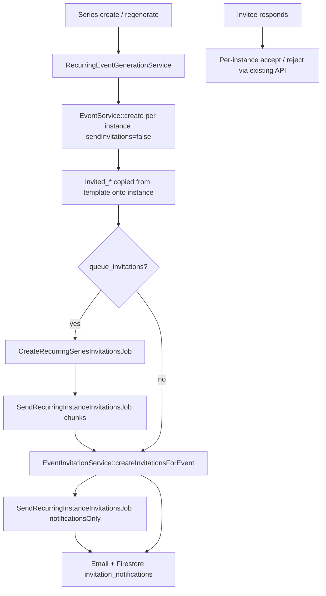

# Recurring Event Invitations & Notifications

## Overview

Invitations belong to **individual `EventV2` instances**, not `RecurringSeries`. The series stores invitee selection in `recurrence_rules.event_template` (`invited_talents`, `invited_organisers`, `invited_venues`). Generation copies those arrays onto each instance and creates `event_invitations` rows via the existing `EventInvitationService`.

## Invitation flow

## Notification flow

| Trigger | Who is notified | Channel |
|--------|------------------|---------|
| Series generation | Pending invitees (new invitations) | `EventInvitationMail`, `invitation_notifications` |
| Apply to future (`apply_to_future: true`) | **Accepted** talent/venue/organiser on updated instances | `EventUpdateMail`, `event_update_notifications` |
| Single occurrence edit | **Accepted** participants on that instance | Same as above |
| Occurrence / series cancel | **Accepted** participants | `EventCancellationMail`, `event_cancellation_notifications` (Phase 6) |

Bulk invitation and update notifications are queued by default (`RECURRING_QUEUE_INVITATIONS`, `RECURRING_QUEUE_UPDATE_NOTIFICATIONS`).

## Files created

| File | Purpose |
|------|---------|
| `app/Services/V2/RecurringSeriesInvitationService.php` | Fan-out invitations to series instances |
| `app/Services/V2/EventInstanceUpdateNotificationService.php` | Notify accepted invitees on updates |
| `app/Jobs/CreateRecurringSeriesInvitationsJob.php` | Queue invitation fan-out |
| `app/Jobs/SendRecurringInstanceInvitationsJob.php` | Chunked create + notification send |
| `app/Jobs/NotifyRecurringInstanceParticipantsJob.php` | Queued update notifications |
| `app/Mail/EventUpdateMail.php` | Update email template |
| `resources/views/emails/event_update.blade.php` | Update email view |
| `tests/Feature/RecurringSeriesInvitationTest.php` | Invitation generation tests |
| `src/components/recurring/RecurringEventInviteFields.vue` | Series form invite pickers |

## Files modified

| File | Change |
|------|--------|
| `RecurringInstancePayloadBuilder.php` | Copy `invited_*` at generation; still excluded from propagation updates |
| `RecurringEventTemplateFromEvent.php` | Extract `invited_*` from source event |
| `RecurringEventGenerationService.php` | Track `created_event_ids`; dispatch invitation job |
| `RecurringSeriesPropagationService.php` | Queue update notifications for propagated instances |
| `IndividualInstanceService.php` | Queue update notifications after occurrence edit |
| `EventInvitationService.php` | `sendNotifications` flag + `sendNotificationsForInvitations()` |
| `FirebaseNotificationService.php` | `createEventUpdateNotification()` |
| `config/recurring.php` | Queue + chunk config |
| `recurringSeries.ts`, `RecurringSeriesForm.vue` | Invite fields in series UI |

## Edge cases

- **Per-instance independence**: Jan 1 accepted / Jan 8 declined works because each instance has its own `event_invitations` rows.
- **Propagation**: `invited_*` are **not** overwritten on apply-to-future; invitations stay per-instance.
- **Modified instances**: Skipped during propagation; only that occurrence’s participants are notified on direct edit.
- **No invitees in template**: Generation skips invitation jobs.
- **Duplicate invitations**: `EventInvitationService::createInvitation` skips existing `(event_id, receiver_id)`.
- **Self-invite / missing user**: Skipped by existing invitation rules.
- **Source event from Create Event Premium**: Invites saved on source event are extracted into template automatically.

## Performance

- Instance creation remains synchronous (or `GenerateRecurringSeriesInstancesJob` when `RECURRING_QUEUE_GENERATION=true`).
- Invitation emails and update emails are **not** sent in the HTTP request when queue flags are true (default).
- Chunk size: `RECURRING_INVITATION_CHUNK_SIZE` / `RECURRING_UPDATE_NOTIFICATION_CHUNK_SIZE` (default 25).
- Safety cap: `RECURRING_MAX_INSTANCES_PER_RUN` still applies.

## Production readiness

- Reuses existing `event_invitations` table and `EventInvitationService` — no parallel invitation architecture.
- Cancellation path unchanged (Phase 6 `EventInstanceDispositionService`).
- Queue workers required when `RECURRING_QUEUE_INVITATIONS=true` (default).
- Firestore collections: `invitation_notifications`, `event_update_notifications`, `event_cancellation_notifications`.
- Recommended: monitor queue depth during large series creation; tune chunk sizes for mail provider limits.
