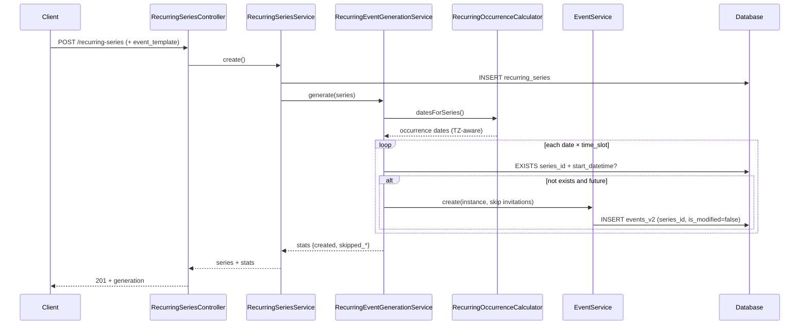

# Recurring Events — Phase 3 Instance Generation

**Status:** Implemented  
**Scope:** Backend materialization of `events_v2` rows from `recurring_series` (weekly + multiple weekdays). No “Apply to future” logic.

---

## Files created

| File | Purpose |
|------|---------|
| `config/recurring.php` | Horizon, max instances, queue toggle |
| `app/Support/Recurrence/RecurringOccurrenceCalculator.php` | Timezone-aware date/slot math (Carbon) |
| `app/Support/Recurrence/RecurringSeriesTemplate.php` | Read/write `event_template` in `recurrence_rules` JSON |
| `app/Validation/Recurring/RecurringEventTemplateValidation.php` | Template field rules (mirrors event create) |
| `app/Services/V2/RecurringEventGenerationService.php` | Orchestrates idempotent instance creation |
| `app/Jobs/GenerateRecurringSeriesInstancesJob.php` | Optional queued generation |
| `docs/RECURRING_EVENTS_PHASE3_GENERATION.md` | This document |

## Files modified

| File | Change |
|------|--------|
| `app/Services/V2/EventService.php` | `series_id`, `is_modified`, inherited publish/approval; `sendInvitations` flag |
| `app/Services/V2/RecurringSeriesService.php` | Merge template, trigger generation on create/update/regenerate |
| `app/Http/Controllers/V2/RecurringSeriesController.php` | Generation stats in responses; `POST …/regenerate` |
| `app/Http/Requests/V2/StoreRecurringSeriesRequest.php` | Requires `event_template` |
| `app/Http/Requests/V2/UpdateRecurringSeriesRequest.php` | Optional `event_template` on update |
| `app/Models/RecurringSeries.php` | `eventTemplate()` helper |
| `routes/v2.php` | `POST /recurring-series/{id}/regenerate` |

**No database migrations** — template stored in existing `recurrence_rules` JSON (`event_template`, `time_slots`).

---

## Generation flow

1. **Create series** (`POST /api/v2/recurring-series`)
   - Validates recurrence + `event_template`
   - Persists series with `event_template` embedded in `recurrence_rules`
   - Runs generation (sync or queued)

2. **Update series** (`PUT /api/v2/recurring-series/{id}`)
   - When recurrence fields or template change → idempotent regeneration (adds missing future instances only)

3. **Regenerate** (`POST /api/v2/recurring-series/{id}/regenerate`)
   - Owner-only; same idempotent pass

4. **`RecurringEventGenerationService::generate()`**
   - Validates series (dates, timezone, weekly weekdays, template, slots)
   - `RecurringOccurrenceCalculator::datesForSeries()` → calendar dates in series IANA timezone
   - For each date × time slot:
     - Skip if `start_datetime` &lt; now (series TZ)
     - Skip if instance already exists (`series_id` + `start_datetime`)
     - Build payload from template + computed datetimes
     - `EventService::create($payload, $organizer, sendInvitations: false)`
   - Entire run wrapped in `DB::transaction` (rollback on fatal error)

---

## Sequence diagram



---

## API: `event_template`

Stored inside `recurrence_rules` (no new columns). Required on create.

```json
{
  "recurrence_type": "weekly",
  "recurrence_rules": { "weekdays": [1, 3, 5] },
  "timezone": "Europe/Amsterdam",
  "start_date": "2026-01-01",
  "end_date": "2026-06-30",
  "event_template": {
    "title": "Weekly Jazz Night",
    "event_type": "premium",
    "category_id": 1,
    "address": "Main St 1",
    "latitude": 52.37,
    "longitude": 4.89,
    "start_time": "19:00",
    "end_time": "22:00",
    "description": "...",
    "publish_status": "draft",
    "is_approved": false
  }
}
```

`time_slots` auto-derived from template times if omitted. Multiple slots supported:

```json
"recurrence_rules": {
  "weekdays": [1, 3, 5],
  "time_slots": [
    { "start_time": "10:00", "end_time": "12:00" },
    { "start_time": "18:00", "end_time": "21:00" }
  ]
}
```

### Regenerate endpoint

`POST /api/v2/recurring-series/{id}/regenerate`  
Response includes `generation`: `{ created, skipped_existing, skipped_past, total_candidates }`.

---

## Performance considerations

| Topic | Approach |
|-------|----------|
| Duplicate check | Preload existing `start_datetime` keys per series once per run |
| Horizon | Open-ended series capped by `RECURRING_GENERATION_HORIZON_MONTHS` (default 12) |
| Safety cap | `RECURRING_MAX_INSTANCES_PER_RUN` (default 500) |
| Transactions | Single transaction per generation run |
| Invitations | Skipped on bulk generate (`sendInvitations: false`) to avoid email storms |
| Queue | Set `RECURRING_QUEUE_GENERATION=true` to dispatch `GenerateRecurringSeriesInstancesJob` |

---

## Edge cases

| Case | Behavior |
|------|----------|
| Past dates in range | Skipped (`skipped_past`) |
| Duplicate slot | Skipped (`skipped_existing`) — idempotent |
| Overnight events | `end_datetime` rolls to next calendar day |
| Open `end_date` | Generates through horizon months from today |
| `is_modified` instances | Not updated; duplicate check still prevents same `start_datetime` |
| Non-weekly types | `InvalidArgumentException` until calculator extended |
| Series without template | Generation fails with clear error |
| DST transitions | Handled via IANA timezone + Carbon parsing local wall times |

---

## Future extension points

- **Bi-weekly / monthly / yearly** — extend `RecurringOccurrenceCalculator` + `RecurrenceRulesSchema` (no migration)
- **Apply to future** — out of scope; would diff template changes vs unmodified instances
- **Horizon cron** — scheduled job to extend open-ended series periodically
- **Invitation batching** — optional per-instance or series-level invite strategy
- **Admin approve series** — propagate `is_approved` to new instances via template defaults
- **Dedicated `template_event_id` column** — if JSON template becomes too large

---

## Config (`.env`)

```env
RECURRING_GENERATION_HORIZON_MONTHS=12
RECURRING_MAX_INSTANCES_PER_RUN=500
RECURRING_QUEUE_GENERATION=false
```

---

## Explicitly not implemented

- Apply-to-future / exception edit flows
- Frontend occurrence calculation (all generation is server-side)
- Deleting stale instances when series rules shrink
