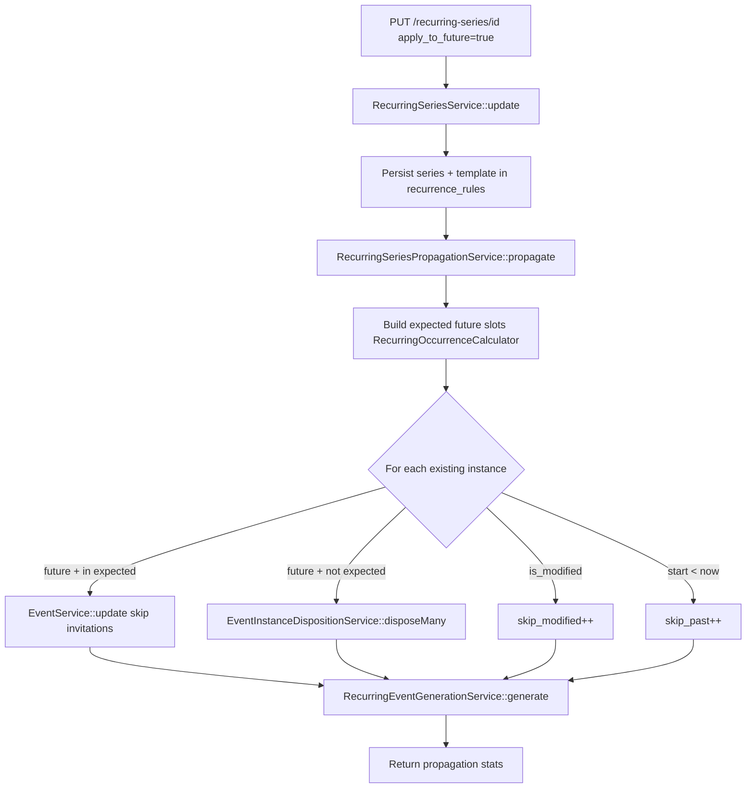

# Recurring Events — Phase 4 Series Update Propagation

**Status:** Implemented  
**Trigger:** `PUT /api/v2/recurring-series/{id}` with `apply_to_future: true`

---

## Business rules

| Rule | Behavior |
|------|----------|
| `is_modified = true` | **Never** updated or deleted — permanently independent |
| Past instances | **Never** touched |
| Future unmodified in schedule | Updated from series `event_template` + recalculated datetimes |
| Future unmodified not in schedule | Removed via `EventInstanceDispositionService` (soft-delete or cancel + notify when accepted invitations exist) |
| Missing future slots | Created via `RecurringEventGenerationService` (idempotent) |
| Invitations | **Never** re-sent or overwritten during propagation |
| Timezone change | Expected slots recalculated in **new** IANA timezone using wall-clock times |

---

## Flow diagram



---

## Propagation algorithm

1. **Load template** from `recurrence_rules.event_template`.
2. **Compute expected slots** — all future `(date × time_slot)` keys as `Y-m-d H:i:s` in series timezone.
3. **For each `events_v2` row** with `series_id`:
   - `is_modified` → skip (count `skipped_modified`)
   - `start_datetime < now` (series TZ) → skip (count `skipped_past`)
   - Key matches expected → `EventService::update()` with payload from `RecurringInstancePayloadBuilder` (`sendInvitations: false`)
   - Key does not match → `EventInstanceDispositionService::disposeMany()` (delete when no accepted invitations; cancel + notify otherwise)
4. **Generate** missing instances — `RecurringEventGenerationService::generate()` (skips existing keys).
5. Entire propagation runs inside **one DB transaction**.

---

## Fields propagated

All template fields applied per occurrence via shared `RecurringInstancePayloadBuilder`:

- Title, description, category, subcategories
- Venue, address, coordinates, venue_name, venue_details
- Times: `start_time`, `end_time`, `start_datetime`, `end_datetime`, dates
- Images: `image_path`, `additional_images`
- Dress code, age limit, entrance fields, conditions
- Contact/social/ticket metadata, show flags, `publish_status`
- Premium: `organiser_ids`, `talent_ids` (synced on update)

**Excluded:** `invited_*`, `series_id`, `is_modified`, instance `id`, accepted invitations.

---

## API

```json
PUT /api/v2/recurring-series/42
{
  "event_template": { "title": "Updated title", ... },
  "recurrence_rules": { "weekdays": [1, 3, 5] },
  "timezone": "Europe/Amsterdam",
  "apply_to_future": true
}
```

**Response** (when `apply_to_future: true`):

```json
{
  "success": true,
  "data": { ... },
  "propagation": {
    "updated": 12,
    "removed": 2,
    "skipped_modified": 1,
    "skipped_past": 8,
    "generation": {
      "created": 3,
      "skipped_existing": 12,
      "skipped_past": 0,
      "total_candidates": 15
    }
  }
}
```

When `apply_to_future` is omitted or `false`, only the series record is updated — **no** instance changes.

---

## Files created

| File | Purpose |
|------|---------|
| `app/Services/V2/RecurringSeriesPropagationService.php` | Propagation orchestration |
| `app/Support/Recurrence/RecurringInstancePayloadBuilder.php` | Shared instance payload mapping |
| `docs/RECURRING_EVENTS_PHASE4_PROPAGATION.md` | This document |

## Files modified

| File | Change |
|------|--------|
| `app/Services/V2/RecurringSeriesService.php` | `apply_to_future` gate; calls propagation |
| `app/Services/V2/EventService.php` | `update(..., sendInvitations: bool)` |
| `app/Services/V2/RecurringEventGenerationService.php` | Uses shared payload builder |
| `app/Http/Requests/V2/UpdateRecurringSeriesRequest.php` | `apply_to_future` validation |
| `app/Http/Controllers/V2/RecurringSeriesController.php` | Returns `propagation` in response |
| `src/api/recurringSeries.ts` | Update payload + propagation types |
| `src/pages/packages/RecurringSeriesForm.vue` | “Apply to future” checkbox (edit) |

---

## Performance review

| Aspect | Approach |
|--------|----------|
| Instance load | Single query per series (`where series_id`) |
| Expected slots | O(days × slots) in-memory map keyed by datetime |
| Updates | Reuses `EventService::update` — no duplicated field logic |
| Deletes | Soft delete via `EventService::delete` |
| Generation | Reuses Phase 3 idempotent pass |
| Transaction | One outer transaction per propagation run |
| Invitation storm | `sendInvitations: false` on bulk update |

**Risk:** Large series (500+ future instances) — same caps as Phase 3 (`RECURRING_MAX_INSTANCES_PER_RUN`). Consider queueing propagation in a future phase.

---

## Edge cases

| Case | Behavior |
|------|----------|
| Modified instance on dropped weekday | Left untouched (not deleted) |
| Timezone change | Old future unmodified instances not in new expected set → removed; new slots generated |
| Template time change | Old slot key obsolete → deleted; new slot created |
| `apply_to_future: false` | Series JSON updated only; instances unchanged |
| Past modified instance | Skipped (past + modified) |
| Duplicate `start_datetime` | Prevented by generation idempotency |
| Series `end_date` shortened | Obsolete future unmodified instances removed |

---

## Future extension points

- Queued propagation job for large series
- “Apply to future” preview/dry-run endpoint
- Bi-weekly/monthly schedule propagation
- Selective field propagation (partial template merge)
