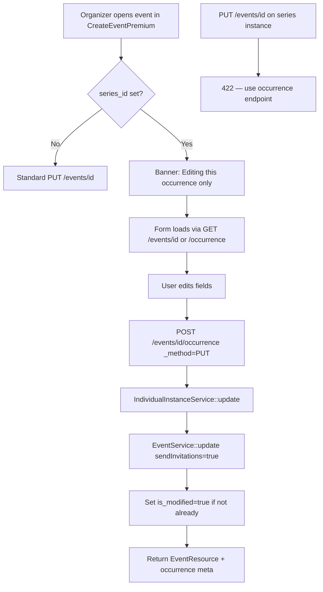

# Recurring Events — Phase 5 Individual Instance Management

**Status:** Implemented  
**Trigger:** `GET|PUT|POST /api/v2/events/{id}/occurrence`

---

## Business rules

| Rule | Behavior |
|------|----------|
| Edit one occurrence | **Never** updates `recurring_series` or `recurrence_rules` |
| On occurrence save | `is_modified = true` (automatic, server-side) |
| Future series propagation | **Ignores** `is_modified = true` (Phase 4) |
| Generic `PUT /events/{id}` | **Rejected** (422) for series instances — forces occurrence endpoint |
| Client payload | `series_id` and `is_modified` are **prohibited** |
| Editable fields | Same as normal event update (title, description, venue, coords, images, times, category, status, invites, etc.) |

---

## Flow diagram

---

## Edit algorithm

1. **Authorize** — event must have `series_id`; user must be owner or admin (`UpdateEventOccurrenceRequest`).
2. **Strip protected keys** — remove `series_id`, `is_modified` from validated input.
3. **Delegate update** — `EventService::update($event, $data, $request, sendInvitations: true)` reuses existing image handling, venue sync, invitation profiles, datetime logic.
4. **Mark modified** — if `is_modified` is still false, `UPDATE events_v2 SET is_modified = true`.
5. **Never touch** — `recurring_series`, `recurrence_rules`, or sibling instances.

---

## Override logic

| Layer | Protection |
|-------|------------|
| `UpdateEventRequest` | `series_id`, `is_modified` prohibited on generic update |
| `EventController::update` | 422 when `isSeriesInstance()` |
| `EventService::update` | `unset($data['series_id'], $data['is_modified'])` |
| `IndividualInstanceService` | No `RecurringSeries` model calls |
| `RecurringSeriesPropagationService` | Skips `is_modified` instances (Phase 4) |

Once `is_modified = true`, the occurrence is an **independent override** for that `start_datetime` slot. Series template changes with `apply_to_future` will not overwrite it.

---

## API endpoints

| Method | Path | Purpose |
|--------|------|---------|
| `GET` | `/api/v2/events/{id}/occurrence` | View occurrence (owner); includes `occurrence` meta |
| `PUT` | `/api/v2/events/{id}/occurrence` | Update occurrence |
| `POST` | `/api/v2/events/{id}/occurrence` | Multipart update (`_method=PUT`) |

`GET /api/v2/events/{id}` also returns `series_id`, `is_modified`, `is_series_instance`, and optional `recurring_series` summary for the edit form.

---

## Frontend workflow

**File:** `src/pages/packages/CreateEventPremium.vue`

1. Load event from sidebar or `?edit={id}` (optional `?occurrence=1`).
2. If `series_id` / `is_series_instance` → show amber banner; hide “Recurring Event” checkbox.
3. Save → `eventService.updateEventOccurrence()` → `POST /v2/events/{id}/occurrence`.
4. Link in banner → `/create-event-premium/recurring-series/{seriesId}/edit` for series-level edits.

**API client:** `src/services/eventService.ts` — `getEventOccurrenceById`, `updateEventOccurrence`.

---

## Files modified

### Backend

| File | Change |
|------|--------|
| `app/Services/V2/IndividualInstanceService.php` | **New** — show / update occurrence |
| `app/Http/Controllers/V2/EventOccurrenceController.php` | **New** — HTTP layer |
| `app/Http/Requests/V2/UpdateEventOccurrenceRequest.php` | **New** — extends `UpdateEventRequest` |
| `app/Services/V2/EventService.php` | Strip `series_id`, `is_modified` on generic update |
| `app/Http/Requests/V2/UpdateEventRequest.php` | Prohibit `series_id`, `is_modified` |
| `app/Http/Controllers/V2/EventController.php` | Series fields on `show`; block generic update for instances |
| `app/Http/Resources/V2/EventResource.php` | Series linkage fields |
| `routes/v2.php` | Occurrence routes |

### Frontend

| File | Change |
|------|--------|
| `src/services/eventService.ts` | Occurrence GET/POST helpers |
| `src/pages/packages/CreateEventPremium.vue` | Banner, routing, occurrence save |

---

## Potential edge cases

| Case | Handling |
|------|----------|
| Client calls `PUT /events/{id}` on series instance | 422 with message to use `/occurrence` |
| Client sends `is_modified: false` on occurrence update | Prohibited / stripped; server always sets true after edit |
| Re-edit already modified occurrence | Idempotent `is_modified`; only changed fields persisted via `EventService` |
| Time change on occurrence | Allowed; slot key in propagation is by existing row id, not recalculated series slot — modified row kept |
| Delete occurrence | Not in Phase 5; use existing event delete if needed |
| Invitations on occurrence edit | Normal `EventService` invitation behavior (`sendInvitations: true`) |
| Admin edits occurrence | Allowed via `isAdmin()` in service |
| Non-series event hits `/occurrence` | 404 from `IndividualInstanceService` |
| Propagation after occurrence edit | Modified instance skipped; unmodified siblings still update |

---

## Production review

**Strengths**

- Reuses `EventService::update` and `UpdateEventRequest` validation — no duplicate field rules.
- Hard separation: occurrence endpoint vs generic update prevents accidental series-instance edits without `is_modified`.
- Aligns with Phase 4 propagation contract.

**Risks / follow-ups**

- **Occurrence delete / cancel single date** — not implemented; may need `DELETE /occurrence` or soft-delete flag in a later phase.
- **Discoverability** — organizers find instances via My Events sidebar; consider series detail “upcoming instances” list later.
- **Audit** — structured log on occurrence update; consider admin audit trail if required.
- **Concurrent edit** — last write wins on `events_v2`; no optimistic locking.
- **Regression test** — add feature test: update occurrence → `is_modified=true`; propagation skips row.

**Deploy checklist**

1. No migration required.
2. Deploy backend before frontend (422 on old clients still calling generic PUT for instances).
3. Smoke: edit series instance → banner visible → save → `is_modified=1` in DB.
4. Smoke: series update with `apply_to_future` → modified occurrence unchanged.

---

**Stop here — Phase 5 complete.**
