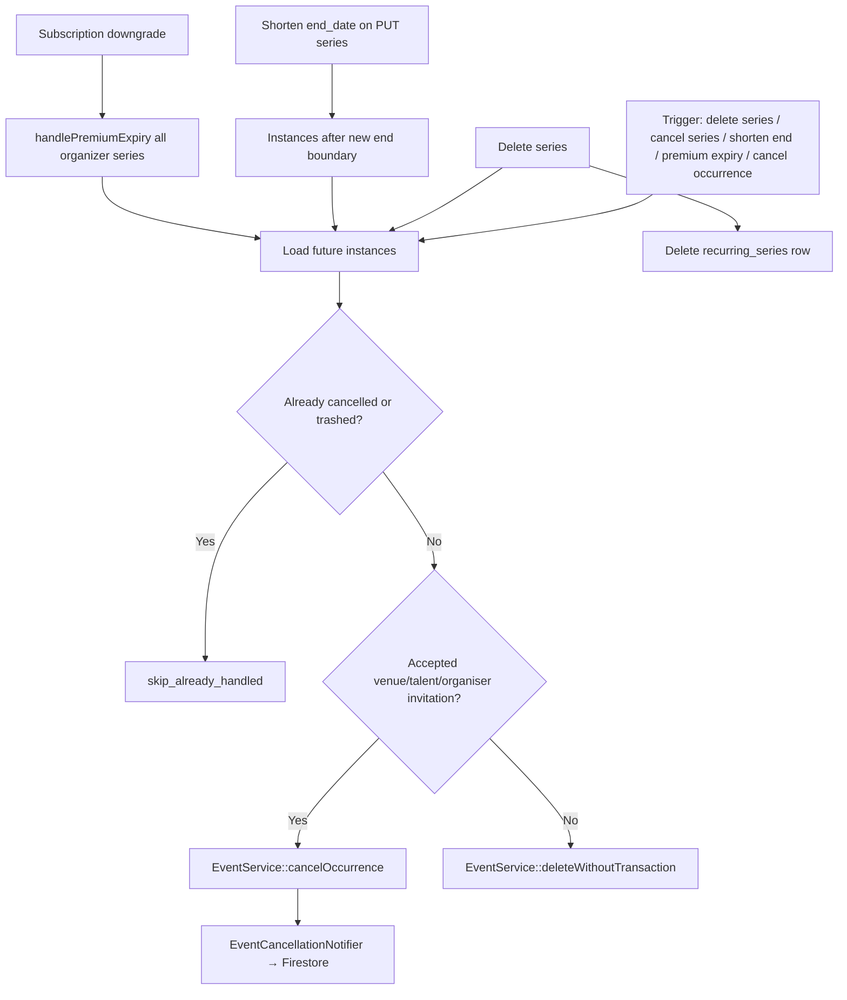

# Recurring Events — Phase 6 Cancellation & Deletion

**Status:** Implemented

---

## Business rules

| Scenario | Accepted invitations? | Action |
|----------|-------------------------|--------|
| Future instance / series delete | No | Soft-delete (`EventService::delete`) |
| Future instance / series delete | Yes (venue, talent, organiser) | `status = cancelled` + notify invitees |
| Past instances | — | Never touched |
| Shorten `end_date` | Same rules | Future instances after new boundary |
| Premium expiry | Same rules | All future instances across organizer's series |
| Delete series | Same rules on futures | Then delete `recurring_series` row |
| Cancel series | Same rules on futures | Series record **kept** |

---

## Workflow diagram

---

## Deletion algorithm

For each **future** `events_v2` row targeted by the operation:

1. Skip if `deleted_at` set or `status = cancelled`.
2. Query `event_invitations` where `status = accepted` and `receiver_type` ∈ `{talent, organiser, venue}`.
3. **If none** → soft-delete via `EventService::deleteWithoutTransaction()`.
4. **If any** → set `status = cancelled` via `EventService::cancelOccurrence()`.
5. Increment stats (`deleted`, `cancelled`, `notified`).

**Delete series** additionally removes the `recurring_series` row after processing futures.

---

## Cancellation algorithm

Same per-instance logic as deletion (steps 1–5). Difference is the **series record remains** and only future instances are processed.

**Cancel occurrence** applies the same single-instance branch; rejects past occurrences (422).

---

## API endpoints

### Organizer (V2)

| Method | Path | Purpose |
|--------|------|---------|
| `DELETE` | `/api/v2/recurring-series/{id}` | Delete series + futures (`confirm: true` required) |
| `POST` | `/api/v2/recurring-series/{id}/cancel` | Cancel futures, keep series |
| `PUT` | `/api/v2/recurring-series/{id}` | Shorten `end_date` triggers lifecycle automatically |
| `POST` | `/api/v2/events/{id}/occurrence/cancel` | Cancel single occurrence |

### Admin

| Method | Path | Purpose |
|--------|------|---------|
| `DELETE` | `/api/admin/recurring-series/{id}` | Delete series + futures |
| `POST` | `/api/admin/recurring-series/{id}/cancel` | Cancel futures |
| `POST` | `/api/admin/events-v2/{id}/cancel-occurrence` | Cancel occurrence |
| `PATCH` | `/api/admin/events-v2/{id}/status` `action=cancel` | Series instances use lifecycle + notifications |

### Premium expiry

Automatic on subscription downgrade via `SubscriptionUserStateService` → `RecurringSeriesLifecycleService::handlePremiumExpiry()`.

---

## Notifications

`EventCancellationNotifier` notifies **accepted** venue, talent, and organiser invitees via `FirebaseNotificationService::createEventCancellationNotification()` (Firestore collection `event_cancellation_notifications`).

---

## Transactions & audit

All lifecycle operations run inside `DB::transaction()`. Structured logs via `Log::info('Recurring series lifecycle', …)` with actions:

- `series_delete`, `series_cancel`, `end_date_shorten`, `premium_expiry`, `occurrence_cancel`, `admin_occurrence_cancel`

---

## Files modified

### Backend (new)

| File | Role |
|------|------|
| `app/Services/V2/RecurringSeriesLifecycleService.php` | Core delete/cancel logic |
| `app/Services/V2/EventCancellationNotifier.php` | Invitee notifications |
| `app/Http/Requests/V2/DeleteRecurringSeriesRequest.php` | `confirm` required |

### Backend (updated)

| File | Change |
|------|--------|
| `app/Services/V2/EventService.php` | `cancelOccurrence`, `deleteWithoutTransaction` |
| `app/Services/V2/FirebaseNotificationService.php` | Event cancellation Firestore docs |
| `app/Services/V2/RecurringSeriesService.php` | Wired lifecycle on delete/cancel/update |
| `app/Services/V2/IndividualInstanceService.php` | `cancel()` |
| `app/Services/Stripe/SubscriptionUserStateService.php` | Premium expiry hook |
| `app/Http/Controllers/V2/RecurringSeriesController.php` | Cancel endpoint, lifecycle response |
| `app/Http/Controllers/V2/EventOccurrenceController.php` | Cancel occurrence |
| `app/Http/Controllers/Admin/AdminRecurringSeriesController.php` | Lifecycle delete/cancel |
| `app/Http/Controllers/Admin/AdminEventV2Controller.php` | Cancel occurrence + series-aware status cancel |
| `routes/v2.php`, `routes/admin.php` | New routes |

### Frontend

| File | Change |
|------|--------|
| `src/api/recurringSeries.ts` | `cancel`, `confirm` on delete, `LifecycleStats` |
| `src/pages/packages/RecurringSeriesList.vue` | Irreversible delete confirmation |
| `src/pages/packages/RecurringSeriesForm.vue` | Shorten end-date confirmation |
| `src/pages/packages/CreateEventPremium.vue` | Cancel occurrence workflow |
| `src/services/eventService.ts` | `cancelEventOccurrence` |

### Admin panel

| File | Change |
|------|--------|
| `src/services/api/recurringSeriesService.js` | `cancel`, confirm on delete |
| `src/views/recurring-series/RecurringSeriesDetail.js` | Cancel series + updated delete |
| `src/views/recurring-series/RecurringSeriesList.js` | Updated delete message |

---

## Performance review

| Area | Notes |
|------|-------|
| Series delete | Loads future instances in one query per series; acceptable for typical horizons (≤500 instances) |
| Premium expiry | Iterates all organizer series sequentially; consider queue if organizers have many series |
| Invitation check | `exists()` per instance — N queries; batch optimization possible later with `whereIn(event_id)` |
| Notifications | Firestore HTTP per accepted invitee; failures logged, non-blocking |
| Nested transactions | Laravel savepoints when lifecycle runs inside series `update` transaction |

---

## Edge cases

| Case | Behavior |
|------|----------|
| Past occurrence cancel | 422 — only future allowed |
| Already cancelled instance | Skipped (`skipped_already_handled`) |
| Modified instance outside shortened end | Still removed/cancelled (end-date shorten ignores `is_modified`) |
| Propagation vs lifecycle | Propagation skips modified; lifecycle for end-date shorten does not |
| Open-ended → fixed end | Treated as shorten; futures after new end processed |
| Premium downgrade while trialing | Only runs when `account_type` was premium |
| Delete without `confirm` | 422 |
| Standalone event admin cancel | Existing `EventService::cancel` (no invitee notifications) |
| Series instance admin cancel | Lifecycle path with notifications |

---

## Production readiness checklist

- [ ] Deploy backend before frontend (delete now requires `confirm: true`)
- [ ] Verify Firestore rules allow `event_cancellation_notifications` writes
- [ ] Smoke: delete series with mix of invited/uninvited future instances
- [ ] Smoke: shorten end date → lifecycle stats in API response
- [ ] Smoke: cancel occurrence → accepted invitee sees Firestore notification
- [ ] Smoke: subscription webhook downgrade → future instances processed
- [ ] Monitor logs for `Recurring series lifecycle` action counts
- [ ] Consider queued premium-expiry processing if volume grows

---

**Stop here — Phase 6 complete.**
